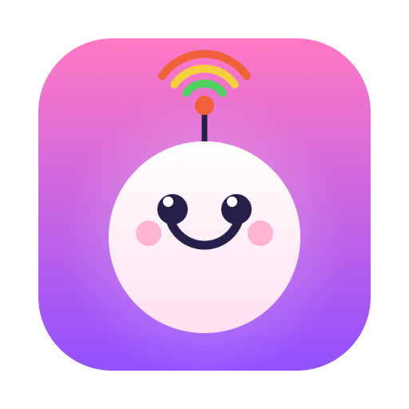

<div align="center">



# Pingky

*A small, cheerful witness to the quality of your connection.*

[](https://github.com/sponsors/ribren)

</div>

---

There is a particular flavor of helplessness reserved for the engineer at 35,000 feet.

The deploy is mid-flight — yours and the plane's. The terminal hangs on a handshake that may never come. You refresh. You toggle Wi-Fi off, then on, with the solemn ritualism of someone restarting a router they cannot see. Somewhere over Nebraska, a satellite is *thinking about it*. And you, you have no idea whether the connection is merely slow, quietly dying, or already gone — only that the spinner keeps spinning and your faith keeps shrinking.

**Pingky** is for that moment.

It sits in the corner of your screen and pings `8.8.8.8` once a second, every second, and paints what it finds: a rolling field of little boxes, green when the world is responsive, sliding through amber toward red as the latency climbs, and going black the instant a packet vanishes into the void. No dashboards. No graphs you have to interpret. Just a small, honest mascot quietly telling you the truth about your link to the rest of humanity — so you know, at a glance, whether to keep waiting or to close the lid and order the tomato juice.

It will not bring the Wi-Fi back. Nothing brings the Wi-Fi back. But at least you'll know.

<div align="center">

*“When the connection finally returns, you'll see it turn green before the spinner does.”*

</div>

---

## What you're looking at

- **3,000 pings of memory** — about fifty minutes of history, packed into a flush **100 × 30** grid of boxes.
- **The newest ping lives in the top-right corner**, and time fills downward then leftward, so the most recent truth is always where your eye lands first.
- **Green** is roughly 0 ms; **red** is 1000 ms or worse; everything between is an honest gradient.
- **A black box is a dropped packet** — a small, dignified tombstone for a request that never came home.
- A header keeps the running score: current latency, packet loss, and **p50 / p90 / p99** over both the last five minutes and the whole window.
- It floats above your other windows, follows you across Spaces, and you can drag it anywhere you like. It remembers where you left it.

## Running it

You'll need macOS 14+ and a Swift toolchain. Pingky leans on the system `/sbin/ping`, which is already privileged, so there's no `sudo`, no helper, no ceremony.

```sh
swift run
```

A small `wave.3.right` icon appears in your menu bar — **Show / Hide** and **Quit** live there. The panel drifts into the top-right of your screen and gets to work.

## Making it a real app

```sh
./make-app.sh        # builds Pingky.app, icon and all, ad-hoc signed
open Pingky.app
```

Drop `Pingky.app` into `/Applications`, add it to **System Settings → General → Login Items**, and it'll be waiting for you on every boot — including the one you do in seat 14C, hopefully, while the cabin lights are still dim.

## How it actually works

Three small pieces, nothing clever:

- **`PingMonitor`** fires a one-second timer, shells out to `/sbin/ping -c 1 -W 1000 8.8.8.8` off the main thread, parses the `time=…`, and appends the result to a 3,000-entry ring buffer.
- **`PingGridView`** draws that whole buffer in a single SwiftUI `Canvas` pass — three thousand boxes, no perceptible cost.
- **`AppDelegate`** hangs it all in a borderless, blurred, always-on-top `NSPanel`.

The mascot, for the record, was rendered entirely in CoreGraphics ([`generate_icon.swift`](generate_icon.swift)). He emits the same green-to-red waves you'll come to either love or dread.

## Buy me a coffee

Pingky is free, and it always will be. But if it ever earns its keep — if it spares you one needless refresh at 35,000 feet, or simply makes the waiting a little more bearable — you'll find a **Buy me a coffee ☕** item tucked into the menu-bar menu, and a [sponsor button](https://github.com/sponsors/ribren) up top. Entirely optional, deeply appreciated, and roughly the price of the airport espresso I'm probably drinking while you read this.

## License

[MIT](LICENSE). Free as in *take it on your next flight*. Do whatever you like with it.
